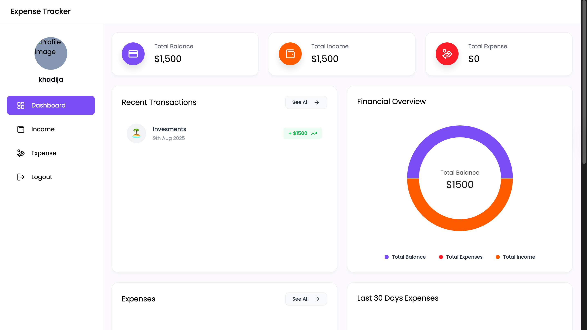
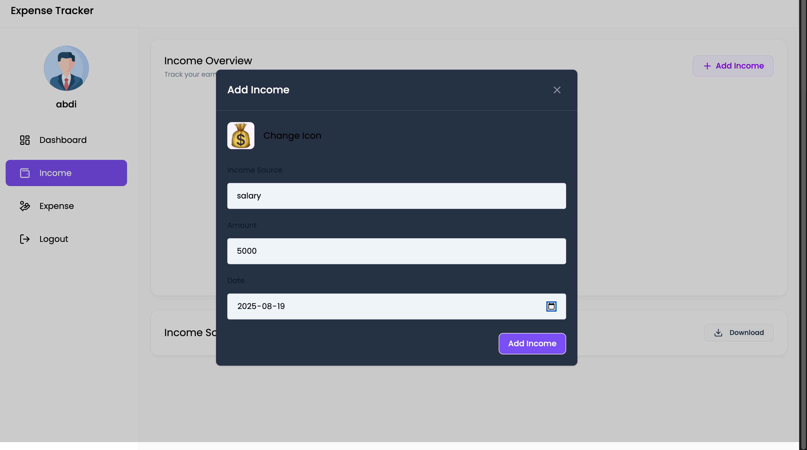
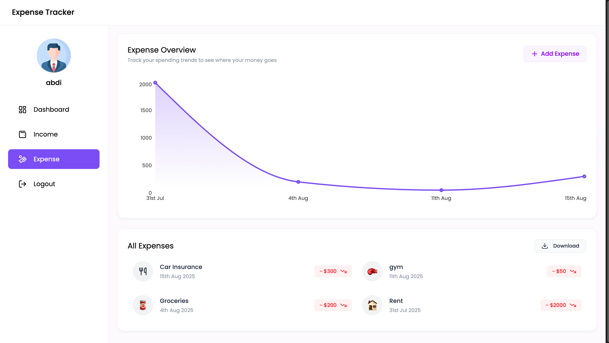

# Expense-Tracker-Application

### MERN expense tracker to record income & expenses, view summaries, and export data.

- Live App: https://expense-tracker-application-five.vercel.app/
- API Base URL: https://expense-tracker-application-8b0i.onrender.com/api/v1
- Database: MongoDB Atlas

## ✨ Features

- JWT auth (register, login, current user)

- Income & Expense CRUD

- Dashboard totals & stats

- Image upload (Multer)

- Export to Excel (XLSX)

- Production-ready CORS and SPA routing on Vercel

## 🧱 Tech Stack

- Frontend: React (Vite), React Router, Tailwind CSS, Axios, Context API

- Backend: Node.js, Express 5, Mongoose, Multer, JSON Web Tokens

- Deploy: Vercel (frontend), Render (API), MongoDB Atlas (DB)

## 🔌 API Overview

### Auth

- POST /auth/register

- POST /auth/login

- GET /auth/getUser — requires Authorization: Bearer <token>

- POST /auth/upload-image — multipart/form-data (field name must match Multer config)

### Income

- POST /income/add

- GET /income/get

- DELETE /income/:id

- GET /income/downloadexcel

### Expense

- POST /expense/add

- GET /expense/get

- DELETE /expense/:id

- GET /expense/downloadexcel

### Dashboard

- GET /dashboard — aggregated totals/stats

## FileTree

```
.
├── README.md
├── backend
│   ├── config
│   ├── controllers
│   ├── expense_details.xlsx
│   ├── income_details.xlsx
│   ├── middleware
│   ├── models
│   ├── package-lock.json
│   ├── package.json
│   ├── routes
│   ├── server.js
│   └── uploads
└── frontend
    └── expense-tracker

```

## Usage






